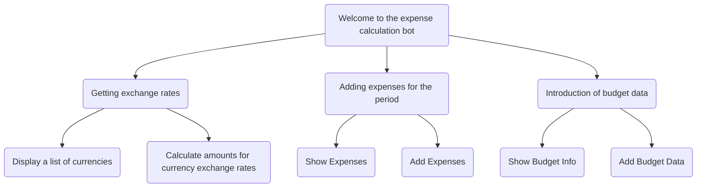

# Nest.js Telegram Budget bot

## Description
Bot for calculating expenses and calculating current exchange rates

An example of the functionality is shown in the diagram:



## Installation

```bash
$ npm install / yarn install
```

## Running the app

```bash
# development
$ npm run start

# watch mode
$ npm run start:dev

# production mode
$ npm run start:prod
```